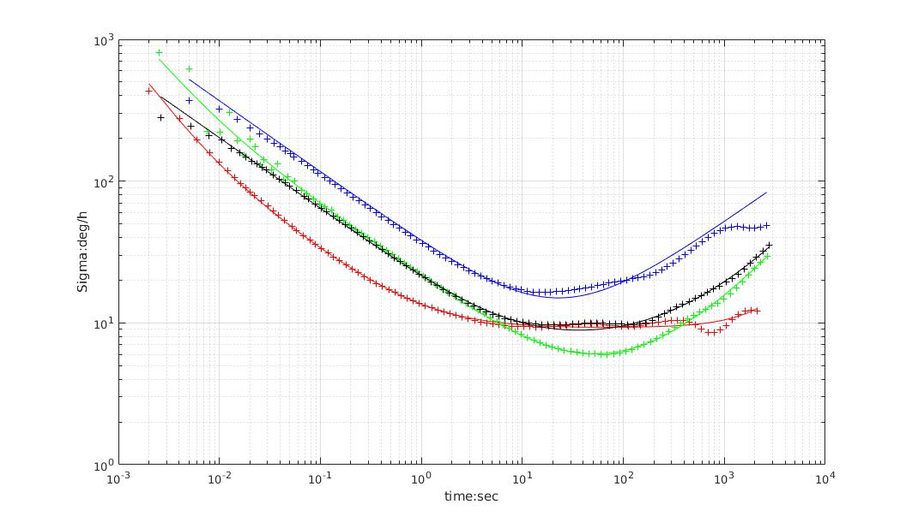
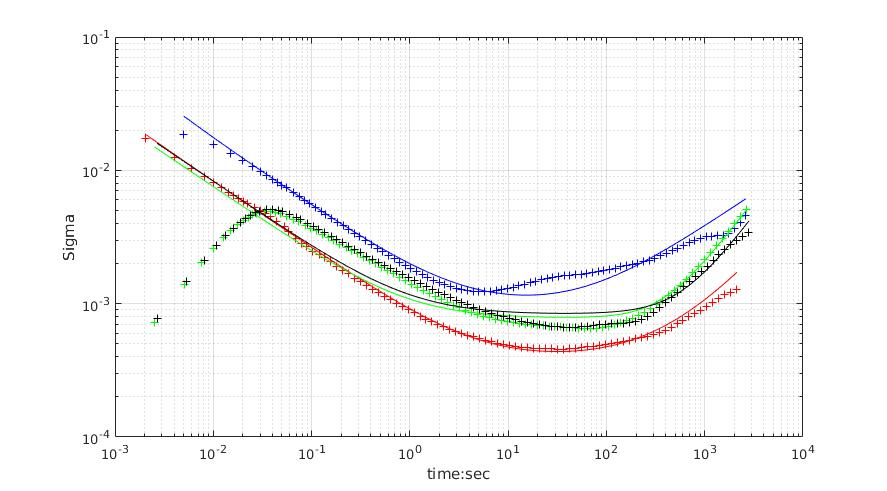

# imu_tools

A tool to analyze the IMU performance. C++ version of Allan Variance Tool. The figures are drawn by Matlab, in `scripts`.

Actually, just analyze the Allan Variance for the IMU data. Collect the data while the IMU is Stationary.


## refrence

Refrence technical report: [`Allan Variance: Noise Analysis for Gyroscopes`](http://cache.freescale.com/files/sensors/doc/app_note/AN5087.pdf "Allan Variance: Noise Analysis for Gyroscopes"), [`vectornav gyroscope`](https://www.vectornav.com/support/library/gyroscope "vectornav gyroscope"), 
[`An introduction to inertial navigation`](http://www.cl.cam.ac.uk/techreports/UCAM-CL-TR-696.html "An introduction to inertial navigation")

```
Woodman, O.J., 2007. An introduction to inertial navigation (No. UCAM-CL-TR-696). University of Cambridge, Computer Laboratory.
```

Refrence Matlab code: [`GyroAllan`](https://github.com/XinLiGitHub/GyroAllan "GyroAllan")

## IMU Noise Values

Parameter | YAML element | Symbol | Units
--- | --- | --- | ---
Gyroscope "white noise" | `gyr_n` |  | 
Accelerometer "white noise" | `acc_n` |  | 
Gyroscope "bias Instability" | `gyr_w` |  | 
Accelerometer "bias Instability" | `acc_w` |  | 

* White noise is at tau=1;

* Bias Instability is around the minimum;

(according to technical report: [`Allan Variance: Noise Analysis for Gyroscopes`](http://cache.freescale.com/files/sensors/doc/app_note/AN5087.pdf "Allan Variance: Noise Analysis for Gyroscopes"))

## sample test




* blue  : Vi-Sensor, ADIS16448, `200Hz`
* red   : 3dm-Gx4, `500Hz`
* green : DJI-A3, `400Hz`
* black : DJI-N3, `400Hz`

DJI A3: `400Hz`

Download link: [`百度网盘`](https://pan.baidu.com/s/1jJYg8R0 "DJI A3")


DJI A3: `400Hz`

Download link: [`百度网盘`](https://pan.baidu.com/s/1pLXGqx1 "DJI N3")


ADIS16448: `200Hz`
 
Download link:[`百度网盘`](https://pan.baidu.com/s/1dGd0mn3 "ADIS16448")

3dM-GX4: `500Hz`

Download link:[`百度网盘`](https://pan.baidu.com/s/1ggcan9D "GX4")
